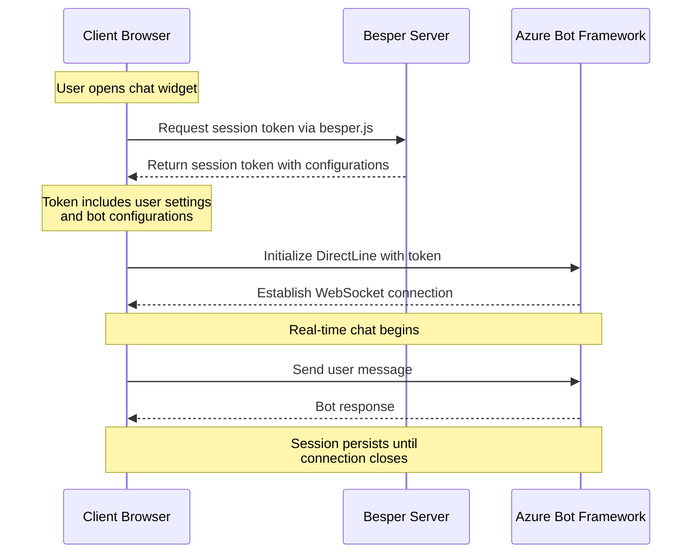

# Azure Bot Chat Implementation Guide

The Besper architecture consists of a client-side implementation using Besper JS and a server-side component (Besper Server) that handles session management and conversation settings.

## Key Components

### Client Side
- **Besper JS Library**: Handles client-side operations including:
  - Session token generation and management
  - Conversation initialization
  - Communication with Besper Server
  - Settings implementation

### Server Side
- **Besper Server**: Core backend service responsible for:
  - Token validation and session management
  - Conversation settings application
  - Security enforcement
  - Real-time communication handling

### Configuration Points
- **Besper Portal**: Web interface for administrators to configure:
  - Conversation settings
  - Security parameters
  - User permissions
  - Integration options

- **API Gateway**: Programmatic interface allowing:
  - Remote configuration
  - Settings management
  - System integration
  - Automated setup

## Flow Description

1. **Initial Setup**
   - Administrators configure conversation settings through the Besper Portal or API Gateway
   - Settings are stored securely in the Besper Server

2. **Session Initialization**
   - Client initializes Besper JS
   - Requests session token from server
   - Server generates and returns secure token

3. **Conversation Creation**
   - Client uses token to request conversation initialization
   - Server validates token and retrieves associated settings
   - Server applies configurations to new conversation
   - Conversation becomes available to client

4. **Active Session**
   - Secure communication channel established
   - All configured settings enforced server-side
   - Real-time updates and modifications possible

## Security Considerations

- All communication secured via TLS
- Session tokens include expiration and are cryptographically signed
- Server-side validation for all requests
- Settings enforced at server level for consistency

## Sequence Diagram



---

## Full HTML Code
```html
<!DOCTYPE html>
<html lang="en">
<head>
    <meta charset="UTF-8">
    <title>Azure Bot Chat</title>
    <style>
        /* Main wrapper for the chat component */
        #besperChatWrapper {
            position: fixed;
            bottom: 20px;
            right: 20px;
            z-index: 2147483647;
        }
        /* Chat bubble (button) styles */
        #besperChatBubble {
            position: absolute;
            bottom: 0;
            right: 0;
            width: 60px;
            height: 60px;
            background-color: #022D54;
            border-radius: 50%;
            display: flex;
            align-items: center;
            justify-content: center;
            cursor: pointer;
            box-shadow: 0 2px 10px rgba(0,0,0,0.2);
            color: #FFFFFF;
            font-family: sans-serif;
            font-weight: bold;
            transition: background-color 0.3s ease;
        }
        #besperChatBubble:hover {
            background-color: #5897DE;
        }
        /* Chat container styles */
        #besperChatContainer {
            position: absolute;
            bottom: 80px;
            right: 0;
            width: 455px;
            height: 500px;
            background-color: #FFFFFF;
            border: 1px solid #ccc;
            border-radius: 8px;
            overflow: hidden;
            display: none;
            box-shadow: 0 5px 15px rgba(0,0,0,0.2);
            transition: all 0.3s ease;
        }
        /* Header bar styles */
        #besperChatHeader {
            background-color: #022D54;
            color: #FFFFFF;
            padding: 12px 20px;
            font-family: sans-serif;
            font-weight: bold;
            font-size: 16px;
        }
        #besperChatContainer.open {
            display: block;
        }
        /* Webchat container styles */
        #besperWebchat {
            width: 100%;
            height: calc(100% - 44px); /* Adjust for header height */
        }
    </style>
</head>
<body>
    <div id="besperChatWrapper">
        <div id="besperChatBubble" title="Toggle Chat">Chat</div>
        <div id="besperChatContainer">
            <div id="besperChatHeader">Besper Bot</div>
            <div id="besperWebchat"></div>
        </div>
    </div>
    <!-- Load Web Chat and BesperJS scripts -->
    <script src="https://cdn.botframework.com/botframework-webchat/latest/webchat.js"></script>
    <script src="https://unpkg.com/besperjs@1.0.1/src/index.js"></script>
    <script>
        (function() {
            // Key variables
            const botId = 'asst_7innZt69zQd2YFWcSeAmbM3O';
            const environment = 'dev';
            let webChatInitialized = false;
            
            document.addEventListener('DOMContentLoaded', () => {
                const bubble = document.getElementById('besperChatBubble');
                const container = document.getElementById('besperChatContainer');
                
                bubble.addEventListener('click', event => {
                    event.stopPropagation();
                    container.classList.toggle('open');
                    // Only fetch session and initialize Web Chat if container is open
                    if (container.classList.contains('open') && !webChatInitialized) {
                        initializeWebChat();
                    }
                });
                
                // Close the chat if user clicks outside the chat bubble/container
                document.addEventListener('click', event => {
                    if (!event.target.closest('#besperChatWrapper')) {
                        container.classList.remove('open');
                    }
                });
            });
            
            async function initializeWebChat() {
                try {
                    // BesperJS session token request
                    const token = await BesperBot.getSessionToken(botId, environment);
                    // Azure Bot Framework Web Chat's DirectLine connection
                    const directLine = window.WebChat.createDirectLine({ token });
                    // Render the Web Chat window.
                    window.WebChat.renderWebChat({
                        directLine: directLine,
                        userID: 'user1',
                        username: 'Web Chat User',
                        locale: 'en-US',
                        /* Style Options for the Web Chat */
                        styleOptions: {
                            // Background color of the chat widget
                            backgroundColor: '#FFFFFF',
                            // Bot bubble styles
                            bubbleBackground: '#F2F2F2',
                            bubbleBorderColor: 'transparent',
                            bubbleBorderRadius: 8,
                            bubbleBorderStyle: 'solid',
                            bubbleBorderWidth: 0,
                            bubbleTextColor: '#000000',
                            // User bubble styles
                            bubbleFromUserBackground: '#5897DE',
                            bubbleFromUserBorderColor: 'transparent',
                            bubbleFromUserBorderStyle: 'solid',
                            bubbleFromUserBorderWidth: 0,
                            bubbleFromUserTextColor: '#FFFFFF',
                            // Send box styles
                            sendBoxBackground: '#FFFFFF',
                            sendBoxButtonColor: '#022D54',
                            sendBoxButtonHoverColor: '#5897DE',
                            sendBoxHeight: 40,
                            sendBoxTextColor: '#000000',
                            // Suggested actions styles (e.g., quick replies)
                            suggestedActionBackgroundColor: '#022D54',
                            suggestedActionBorderColor: '#022D54',
                            suggestedActionBorderRadius: 16,
                            suggestedActionTextColor: '#FFFFFF',
                            // Timestamps
                            timestampColor: '#707070',
                            // Disable attachments (if desired)
                            attachmentsEnabled: false,
                            // Padding options for different sections
                            paddingOptions: {
                                root: '0',
                                chat: '0',
                                bubble: '0',
                                sendBox: '0'
                            },
                            // Avatar customization (bot and user)
                            botAvatarInitials: 'B',
                            botAvatarBackgroundColor: '#022D54',
                            userAvatarInitials: 'U',
                            userAvatarBackgroundColor: '#5897DE',
                            avatarSize: 40,
                            avatarBorderRadius: '50%'
                        },
                        // Middleware to handle activities (if needed for custom behavior)
                        activityMiddleware: () => next => card => {
                            return next(card);
                        },
                        // Toolbar configuration (no special actions here, so it's empty)
                        toolbar: {
                            actions: []
                        }
                    }, document.getElementById('besperWebchat'));
                    webChatInitialized = true;
                } catch (error) {
                    console.error('Error initializing Web Chat:', error);
                }
            }
        })();
    </script>
</body>
</html>
```

## Explanation

1. **BesperJS Part**

   **BesperBot.getSessionToken(botId, environment):** This function call fetches a session token based on your specific Bot ID and environment (e.g., dev, stage, or prod).

   - **Bot ID (botId):** `'asst_7innZt69zQd2YFWcSeAmbM3O'` in this sample, but you will replace it with your own.
   - **Environment (environment):** `'dev'` here, but it can be changed to match your environment’s configuration.

   **Recommendation:** Fetch the session token only when the widget is expanded (as shown in the code). This avoids generating excessive sessions if many users land on the page but never open the chat.

2. **Azure Bot Web Chat Part**

   **Loading Web Chat:** The line:

   ```html
   <script src="https://cdn.botframework.com/botframework-webchat/latest/webchat.js"></script>
   ```

   loads the latest version of the Bot Framework Web Chat client library.

   **Creating a Direct Line:**

   ```js
   const directLine = window.WebChat.createDirectLine({ token });
   ```

   This connects the Web Chat control to your Azure Bot using the token from BesperJS.

   **Rendering Web Chat:**

   ```js
   window.WebChat.renderWebChat({ /* options */ }, document.getElementById('besperWebchat'));
   ```

   Takes your configuration (styleOptions, user data, and so forth) and renders the chat UI in the specified DOM element.

3. **Style Options Explained**

   Inside the `styleOptions` object, each property customizes how your Bot Framework Web Chat looks:

   - `backgroundColor`: The overall background color of the chat pane.
   - `bubbleBackground`: Background color of the bot’s response bubble.
   - `bubbleBorderColor`: The border color around the bot’s bubble.
   - `bubbleBorderRadius`: The corner radius of the bot’s bubble.
   - `bubbleBorderStyle`: The style of the bot’s bubble border (e.g., solid, dashed, etc.).
   - `bubbleBorderWidth`: The thickness of the bot’s bubble border.
   - `bubbleTextColor`: The text color inside the bot’s response bubble.
   - `bubbleFromUserBackground`: The background color of the user’s bubble.
   - `bubbleFromUserBorderColor`: The border color around the user’s bubble.
   - `bubbleFromUserBorderStyle`: The style of the user’s bubble border.
   - `bubbleFromUserBorderWidth`: The thickness of the user’s bubble border.
   - `bubbleFromUserTextColor`: The text color inside the user’s response bubble.
   - `sendBoxBackground`: The background color of the text input area.
   - `sendBoxButtonColor`: The color of the send button (paper plane icon).
   - `sendBoxButtonHoverColor`: The color of the send button when hovered.
   - `sendBoxHeight`: The height of the text input area.
   - `sendBoxTextColor`: The text color in the input area.
   - `suggestedActionBackgroundColor`: The background color of suggested action buttons.
   - `suggestedActionBorderColor`: The border color of suggested action buttons.
   - `suggestedActionBorderRadius`: The corner radius of suggested action buttons.
   - `suggestedActionTextColor`: The text color of suggested action buttons.
   - `timestampColor`: Color of the timestamps on messages.
   - `attachmentsEnabled`: Boolean to enable/disable attachments (e.g., file uploads).
   - `paddingOptions`: Allows you to remove or adjust padding in different sections: `root`, `chat`, `bubble`, and `sendBox`.
   - **Avatar Options:**
     - `botAvatarInitials`: The initials shown in the bot’s avatar.
     - `botAvatarBackgroundColor`: Background color of the bot avatar.
     - `userAvatarInitials`: The initials shown in the user’s avatar.
     - `userAvatarBackgroundColor`: Background color of the user avatar.
     - `avatarSize`: Dimensions of both avatars (width and height).
     - `avatarBorderRadius`: Corner radius of avatars (e.g., 50% for a circle).

4. **Key Variables to Adjust**

   - **botId**
     - Currently set to: `asst_7innZt69zQd2YFWcSeAmbM3O`.
     - Replace with your own Besper Bot ID.
   - **environment**
     - Currently set to: `dev`.
     - Possible values: `dev`, `stage`, `prod` (or others if configured).
   - **Color Variables**
     - `background-color` (bubble, container, and overall chat design).
     - `color` (text and icons).
     - `bubbleBackground`, `bubbleFromUserBackground`, etc. for customizing the chat experience.
   - **Avatar & Other UI Settings**
     - `botAvatarInitials`, `userAvatarInitials`.
     - `avatarBorderRadius` if you want squares or circles.

   **Note:** You can modify these settings to match your branding requirements.

5. **Session Handling Best Practice**

   As shown in the code snippet:

   ```js
   if (container.classList.contains('open') && !webChatInitialized) { initializeWebChat(); }
   ```

   We only fetch the session token and initialize the Bot Framework Web Chat once the user opens the widget. This helps avoid creating unnecessary sessions for users who never interact with the chatbot. If you request tokens on page load for every visitor, your service usage might increase significantly and unnecessarily.